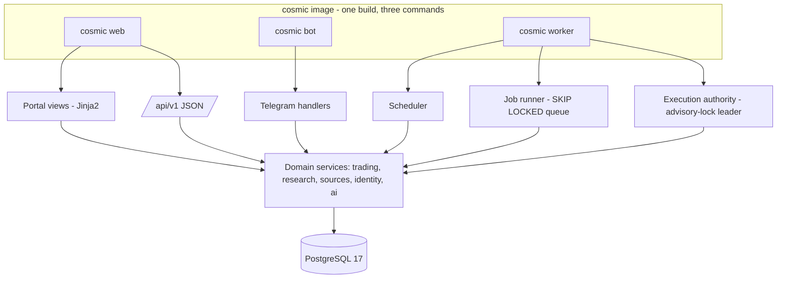

# Containers and modules

```mermaid
flowchart TB
  subgraph image[cosmic image - one build, three commands]
    direction TB
    webc[cosmic web]
    workerc[cosmic worker]
    botc[cosmic bot]
  end
  webc --> portal[Portal views - Jinja2]
  webc --> api[/api/v1 JSON/]
  workerc --> sched[Scheduler]
  workerc --> jobs[Job runner - SKIP LOCKED queue]
  workerc --> execa[Execution authority - advisory-lock leader]
  botc --> handlers[Telegram handlers]
  portal & api & handlers --> services[Domain services: trading, research, sources, identity, ai]
  sched & jobs & execa --> services
  services --> pg[(PostgreSQL 17)]
```
