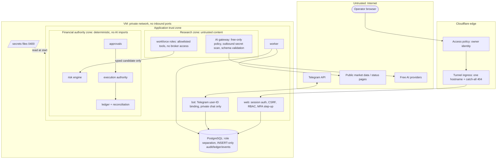

# Trust boundaries

```mermaid
flowchart TB
  subgraph internet[Untrusted: Internet]
    user([Operator browser])
    tgapi[Telegram API]
    web_src[Public market data / status pages]
    aiapi[Free AI providers]
  end
  subgraph edge[Cloudflare edge]
    access[Access policy: owner identity]
    tunnel[Tunnel ingress: one hostname + catch-all 404]
  end
  subgraph vm[VM: private network, no inbound ports]
    subgraph app[Application trust zone]
      webp[web: session auth, CSRF, RBAC, MFA step-up]
      botp[bot: Telegram user-ID binding, private chat only]
      workerp[worker]
      subgraph research[Research zone: untrusted content]
        aigw[AI gateway: free-only policy, outbound secret scan, schema validation]
        wf[workforce roles: allowlisted tools, no broker access]
      end
      subgraph trading[Financial authority zone: deterministic, no AI imports]
        risk[risk engine]
        appr[approvals]
        exec[execution authority]
        ledger[ledger + reconciliation]
      end
    end
    db[(PostgreSQL: role separation, INSERT-only audit/ledger/events)]
    secrets[/secrets files 0400/]
  end
  user --> access --> tunnel --> webp
  tgapi <--> botp
  workerp --> web_src
  aigw --> aiapi
  wf -- typed candidate only --> risk
  appr --> exec --> ledger
  webp --> db
  botp --> db
  workerp --> db
  secrets -. read at start .-> app
```
